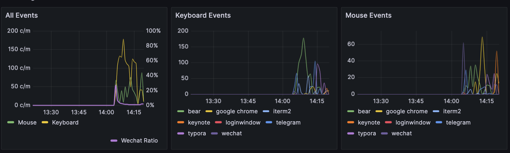

# PPPerf

Profile Your Personal Performance


## Install

```bash
# mac 
pip install -r requirements_mac.txt
# windows
pip install -r requirements_windows.txt
```

## Run

```bash
python perf.py --user [yourusername] --passwd [passwd_to_grafana_backend]
```

## Demo

